# Deploy-Web-Solution-with-Wordpress-on-AWS
This repository explains the steps involved in  preparing storage infrastructure on two Linux servers and implementinga basic web solution using WordPress.

You will gain practical experience that demonstrates `three-tier architecture` while also making sure that the Linux servers' storage disks are properly partitioned and maintained using tools like `gdisk` and `LVM`, respectively. 

### The 3-Tier Setup
1. A Laptop or PC to serve as a client
2. An EC2 Linux Server as a web server (This is where you will install WordPress)
3. An EC2 Linux server as a database (DB) server

-------
_______
### STEP 1 - PREPARE A WEB SERVER
* Launch an EC2 instance that will serve as "Web Server". I will choose Red hat Operating system for the servers.

* Login to the AWS console

* Search for EC2 (Elastic Compute Cloud)

* Select your preferred region (the closest to you) and launch a new EC2 instance and choose Red Hat

* Type a name e.g web-server Click create a new key pair, use any name of your choice as the name for the pem file and select `.pem`.

    * Linux/Mac users, choose .pem for use with openssh. This allows you to connect to your server using open ssh clients.
    
    * For windows users choose .ppk for use with putty. Putty is a software that lets you connect to servers remotely.

* Save your private key (.pem file) securely and do not share it with anyone! If you lose it, you will not be able to connect to your server ever again!

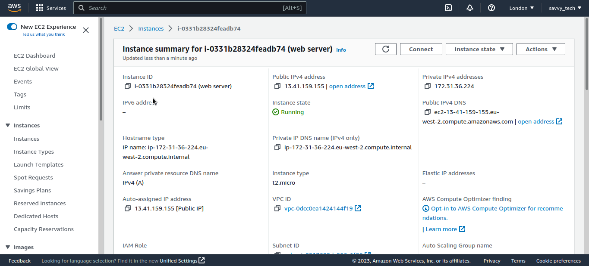

* Create 3 volumes in the same AZ as your Web Server EC2, each of 10 GiB.

    1.  On the left hand side of the aws console, under Elastic Blob Store, Click on `Volume`.

    2.  Click create volume

    3.  Choose a small size of 10GB

    4. change the availability zone to eu-west-2b 
    
    5.  Leave other settings default and click 'Create volume'

    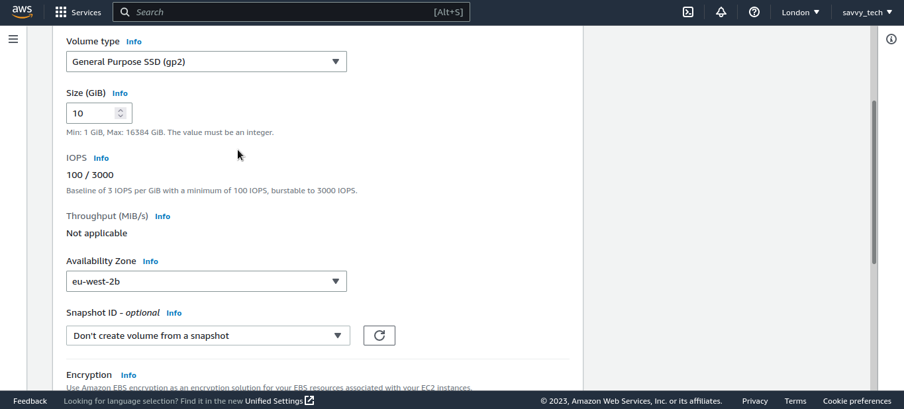

    6.  Next, select the volume created, right click and click `Attach volume`.

    7.  Select the web server instance created. I named my server `web server`. The device name will be `/dev/sdf` but newer Linux kernels may rename your devices to `/dev/xvdf` through /dev/xvdp internally, even when the device name entered is `/dev/sdf`
    
    8.  Click Attach volume 

    

    9.  Repeat steps `2` to `8` for two more volumes so that we can have the 3 volumes in all.

    

    

* On your local computer, open the terminal and change directory to the Downloads folder, type

    `cd ~/Downloads`

* Change permissions for the private key file (.pem), otherwise you can get an error “Bad permission”

    `sudo chmod 0400 . pem`

    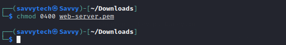

* Connect to the instance by running

   `ssh -i web-server.pem ec2-user@<public ip address>`

   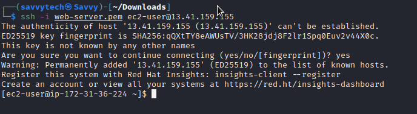

    Note: For Red hat, the usernanme is ec2-user while for Ubuntu the username is ubuntu.

 * check the volumes created by typing `lsblk`. You will see that the 3 volumes are "xvdf" "xvdg" and "xvdh" of size 10GB each respectively as shown below.

    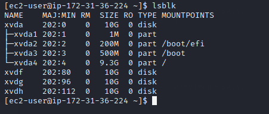

 * Use `df -h` command to see all mounts and free space on your server. `df` means disk free and the flag `-h` displays the output in a human readable format.

    

* Use `gdisk` utility to create a single partition on each of the 3 disks. First start with disk xvdf.

    `sudo gdisk /dev/xvdf`

    * Type p to view the partion table. 

    * Type n to add a new partition. Press enter repeatedly to use the default values

    * Type w to write partition changes to disk. T ype Y on prompt

    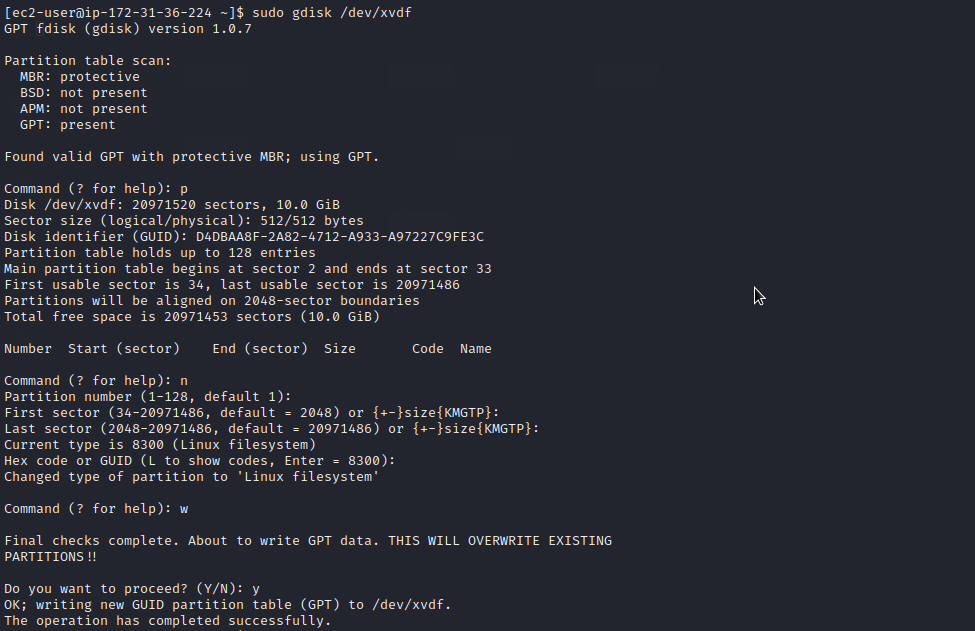

    * Repeat the process for the remaining two disks

    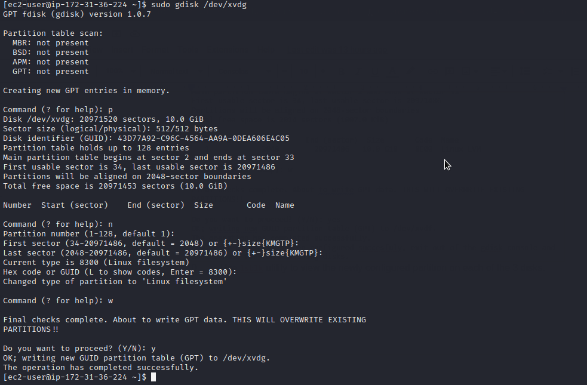

    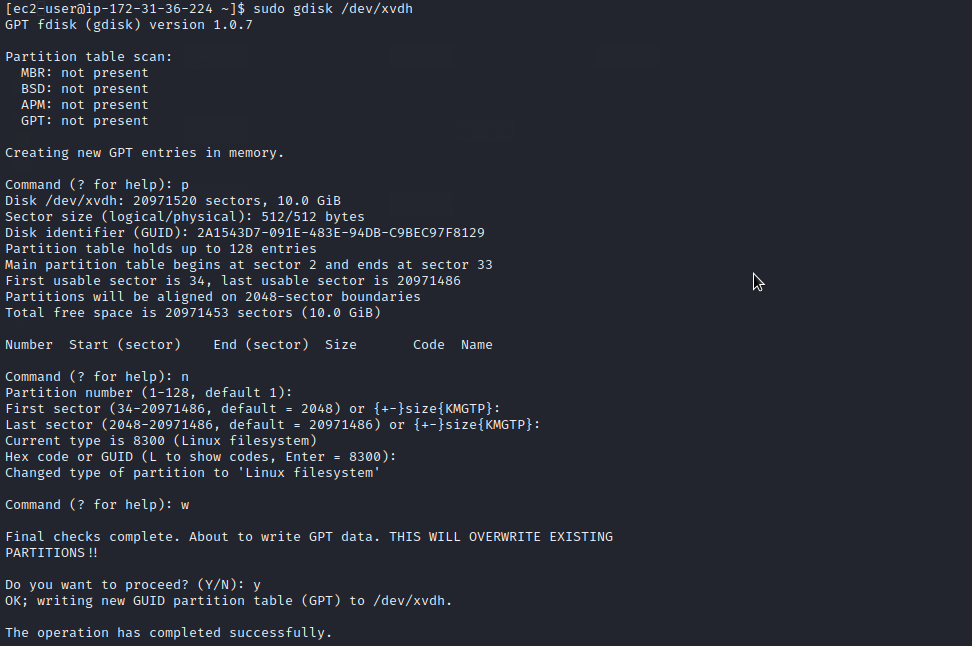

* Use `lsblk` utility to view the newly configured partition on each of the 3 disks.

* Install `lvm2` package using `sudo yum install -y lvm2 `

 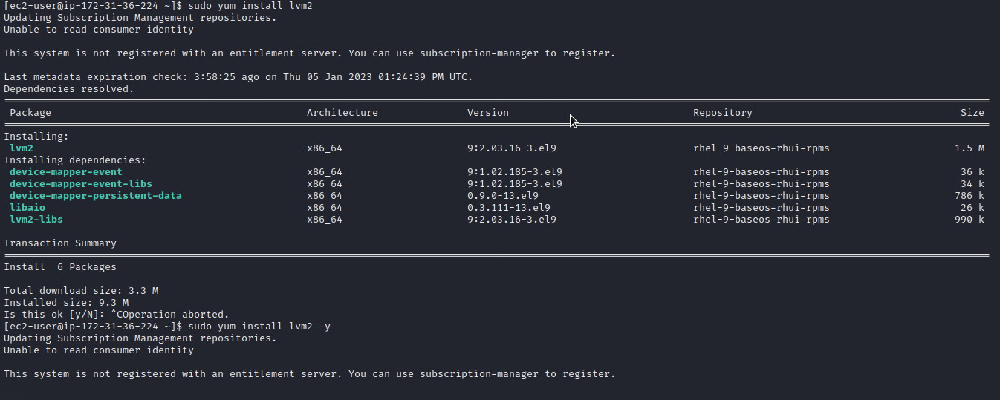

  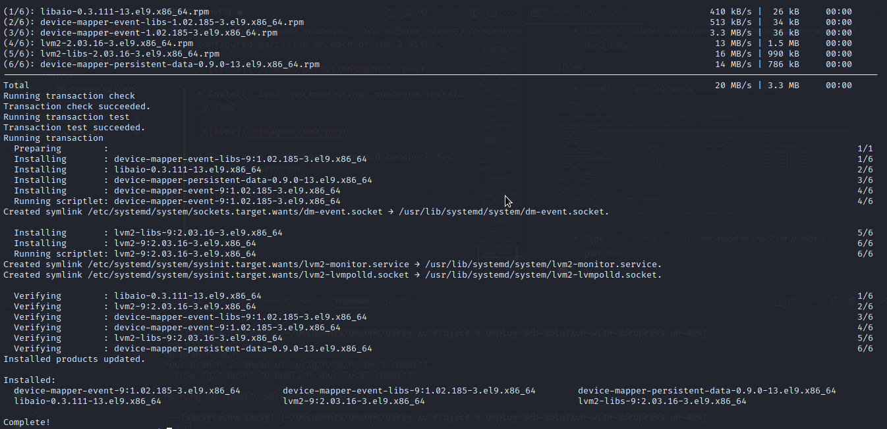

* Type `sudo lvmdiskscan` command to check for available partitions.

 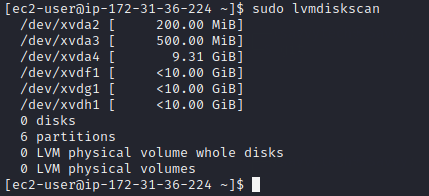
 * Use `pvcreate` utility to mark each of 3 disks as physical volumes (PVs) to be used by LVM
 
    `sudo pvcreate /dev/xvdf1`

    `sudo pvcreate /dev/xvdg1`

    `sudo pvcreate /dev/xvdh1`

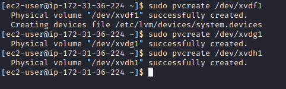

* Verify that your Physical volume has been created successfully by running `sudo pvs`

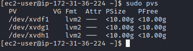

* Use `vgcreate` utility to add all 3 PVs to a volume group (VG). Name the VG webdata-vg. Type

`sudo vgcreate webdata-vg /dev/xvdh1 /dev/xvdg1 /dev/xvdf1`

* Verify that your VG has been created successfully by running `sudo vgs`

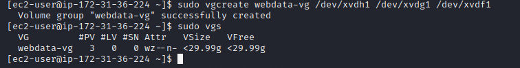

* Use `lvcreate` utility to create 2 logical volumes. Name one apps-lv and use half of the PV size. Name the second one logs-lv and use the remaining space of the PV size. NOTE: apps-lv will be used to store data for the Website while, logs-lv will be used to store data for logs.

    `sudo lvcreate -n apps-lv -L 14G webdata-vg`

    `sudo lvcreate -n logs-lv -L 14G webdata-vg`

* Verify that your Logical Volume has been created successfully by typing `sudo lvs`

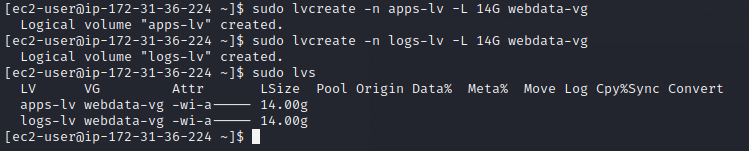

* Verify the entire setup by typing the following commands

    `sudo vgdisplay -v #view complete setup - VG, PV, and LV`

   `sudo lsblk`

   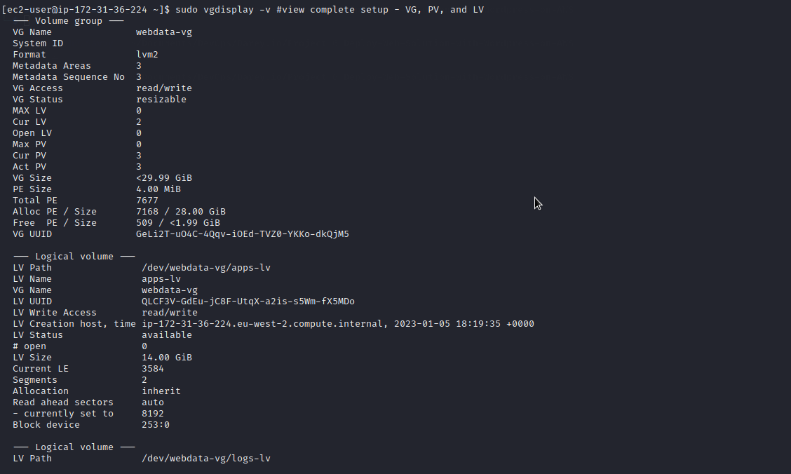

   

   

 * Use `mkfs.ext4` to format the logical volumes with ext4 filesystem

    `sudo mkfs -t ext4 /dev/webdata-vg/apps-lv`

    `sudo mkfs -t ext4 /dev/webdata-vg/logs-lv`

    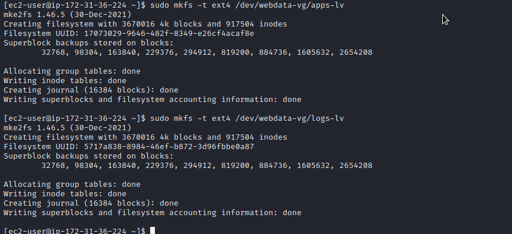

* Create /var/www/html directory to store website files

    `sudo mkdir -p /var/www/html`

* Create /home/recovery/logs to store backup of log data
 
  `sudo mkdir -p /home/recovery/logs`

* Mount /var/www/html on apps-lv logical volume
 
  `sudo mount /dev/webdata-vg/apps-lv /var/www/html/`

  

* Use `rsync` utility to back up all the files in the log directory /var/log into /home/recovery/logs (This is required before mounting the file system). Type

    `sudo rsync -av /var/log/. /home/recovery/logs/`

  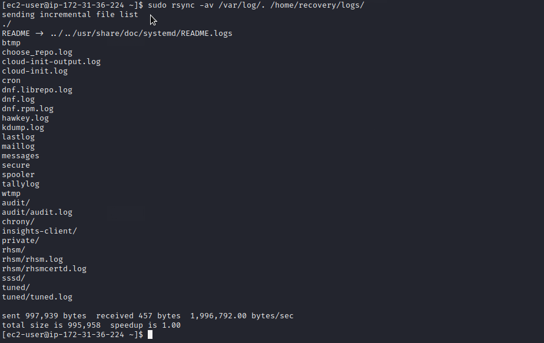

* Mount /var/log on logs-lv logical volume. (Note that all the existing data on /var/log will be deleted. This is why the last step above is very
important)

   `sudo mount /dev/webdata-vg/logs-lv /var/log`

* Restore log files back into /var/log directory

    `sudo rsync -av /home/recovery/logs/. /var/log`

    

* Update `/etc/fstab` file so that the mount configuration will persist after restart of the server. The UUID of the device will be used to update the /etc/fstab file;

  `sudo blkid`

  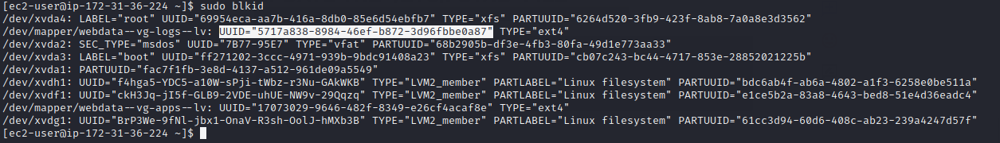

* Now type `sudo vi /etc/fstab`

* Update /etc/fstab in this format using your own UUID as shown below.

  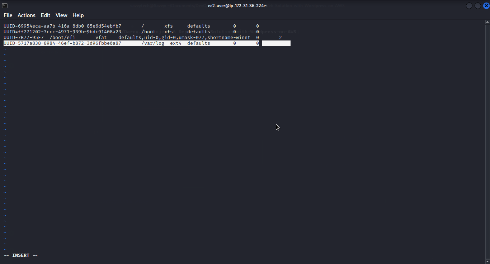

* Test the configuration and reload the daemon
 
   `sudo mount -a`
   `sudo systemctl daemon-reload`

   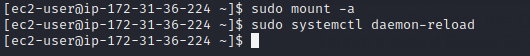
 
* Verify your setup by running `df -h`, output must look like the one in the image below:

  

------
________
### STEP 2 - PREPARE THE DATABASE SERVER
* Launch a second RedHat EC2 instance that will have the role of a Databaser server.

  

* Repeat the same steps as for the Web Server, but instead of apps-lv create db-lv and mount it to /db directory instead of /var/www/html/ directory.

* When you are done, verify your setup by running `df -h`, output must look like the image below.

  

------
______

### STEP 3 - INSTALL WORDPRESS ON THE WEB SERVER
* First, update repository

  `sudo yum -y update`
  
  

* Next, install wget, Apache and it’s dependencies.

  `sudo yum -y install wget httpd php php-mysqlnd php-fpm php-json`

  

  

  

* Enable, start and check the status Apache service to ensure that it is active and running.

  `sudo systemctl enable httpd`

  `sudo systemctl start httpd`

  `sudo systemctl status httpd`

  

* Install PHP and its depemdencies

  `sudo yum install https://dl.fedoraproject.org/pub/epel/epel-release-latest-8.noarch.rpm`

  `sudo yum install yum-utils http://rpms.remirepo.net/enterprise/remi-release-8.rpm`

  `sudo yum module list php`

  `sudo yum module reset php`

  `sudo yum module enable php:remi-7.4`

  `sudo yum install php php-opcache php-gd php-curl php-mysqlnd`

  

  

* Enable and start php-fpm
  
  `sudo systemctl start php-fpm`

  `sudo systemctl enable php-fpm`

* Set SELinux boolean value to 1
  `sudo setsebool -P httpd_execmem 1`

  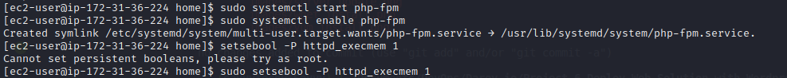

* Restart Apache
  
  `sudo systemctl restart httpd`

* Download wordpress and copy wordpress to var/www/html

      mkdir wordpress
      cd   wordpress
      sudo wget http://wordpress.org/latest.tar.gz
      sudo tar xzvf latest.tar.gz
      sudo rm -rf latest.tar.gz
      cp wordpress/wp-config-sample.php wordpress/wp-config.php
      cp -R wordpress /var/www/html/
  
    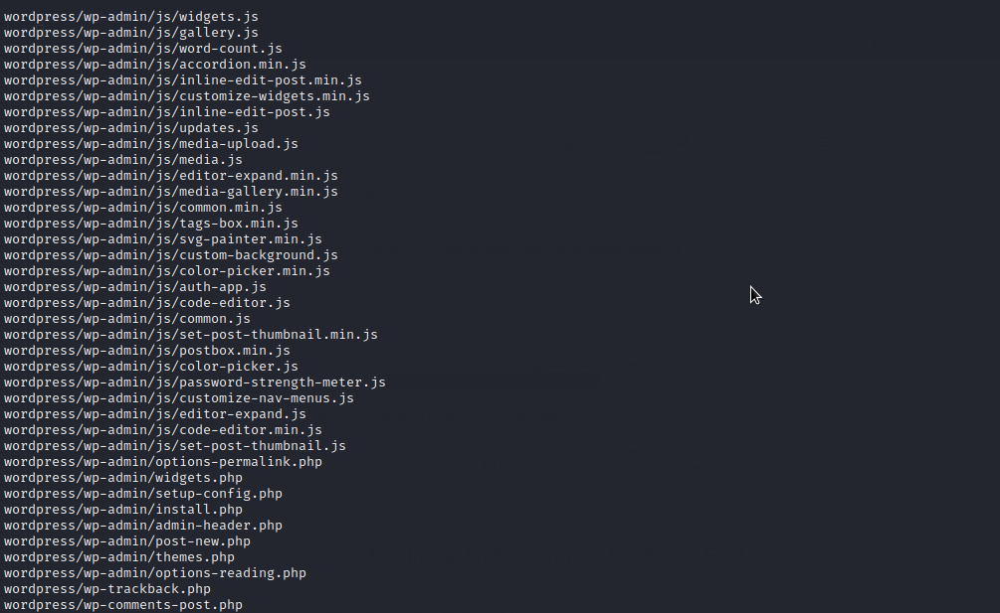

    

    * Configure SELinux Policies

          sudo chown -R apache:apache /var/www/html/wordpress
          sudo chcon -t httpd_sys_rw_content_t /var/www/html/wordpress -R
          sudo setsebool -P httpd_can_network_connect=1
          sudo setsebool -P httpd_can_network_connect_db 1

      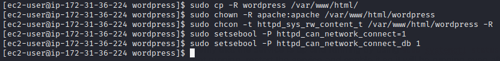

------------
____________

###  STEP 4 - INSTALL MYSQL ON DATABASE SERVER
* Update repository and install mysql-server
  `sudo yum update`

  

  `sudo yum install mysql-server`

  

  

* Verify that the service is up and running by using `sudo systemctl status mysqld`, if it is not running, restart the service and enable it so it will be running even after reboot:

  `sudo systemctl restart mysqld`

  `sudo systemctl enable mysqld`

   

--------
________

### STEP 5 - CONFIGURE DATABASE TO WORK WITH WORDPRESS

      sudo mysql
      CREATE DATABASE wordpress;
      CREATE USER `myuser`@`<Web-Server-Private-IP-Address>` IDENTIFIED BY 'mypass';
      GRANT ALL ON wordpress.* TO 'myuser'@'<Web-Server-Private-IP-Address>';
      FLUSH PRIVILEGES;
      SHOW DATABASES;
      exit

   

        GRANT ALL PRIVILEGES ON *.* TO 'admin'@'%' WITH GRANT OPTION;`

        flush privileges;
        select user, host from mysql.user;
     
   

* Now edit mysql configuration file by typing `sudo vi /etc/my.cnf`. Add the following at the end of the file.

      [mysqld]
      bind-address=0.0.0.0
  
  

  

* Now, restart mysqld service using `sudo systemctl restart mysqld`

-----------
___________

### STEP 6 - CONFIGURE WORDPRESS TO CONNECT TO THE REMOTE DATABASE
Open MySQL port 3306 on DB Server EC2. For extra security, you shall allow access to the DB server ONLY from your Web Server’s IP address, so in the Inbound Rule configuration specify source as /32

* On the web server, edit wordpress configuration file.
 
      cd /var/www/html/wordpress
      vi wp-config.php
* Then restart httpd.

  `sudo systemctl restart httpd`

* Install MySQL client and test that you can connect to your DB server from your Web Server  by using mysql-client.

  `sudo yum install mysql`

  

* Test that you can connect to the database server from the web server.
  
   

* Verify if you can successfully execute Show Databases; command and see a list of existing databases.

  

* Change permissions and configuration so Apache could use WordPress:

      sudo chown -R apache:apache /var/www/html/wordpress
      sudo chcon -t httpd_sys_content_t /var/www/html/wordpress -R
      sudo setsebool -P httpd_can_network_connect=1

* Enable TCP port 80 in Inbound Rules configuration for your Web Server EC2 (enable from everywhere 0.0.0.0/0 or from your workstation’s IP).

  

* Try to access from your browser the link to your WordPress `http://<Web-Server-Public-IP-Address>/wordpress/`

