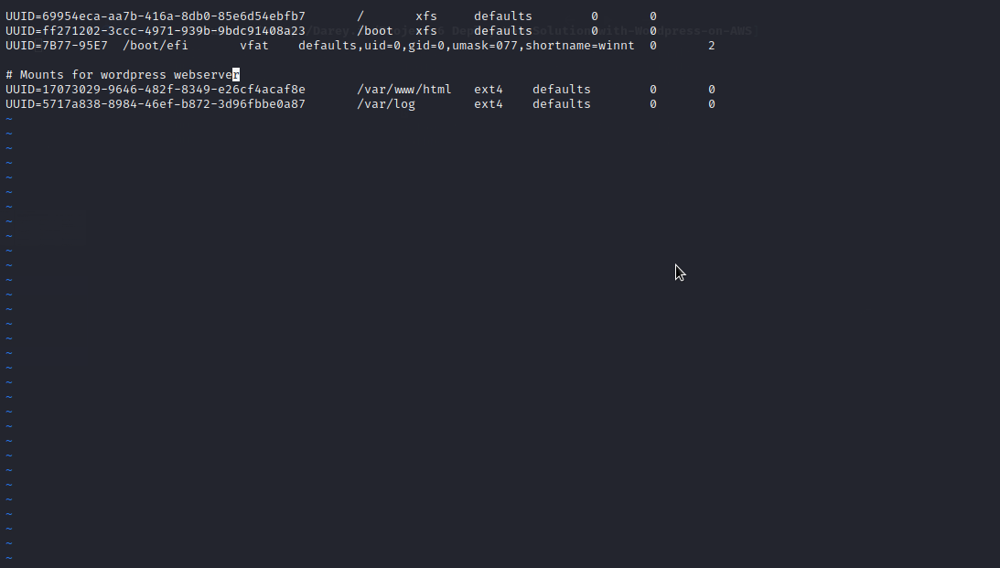

# Deploy-Web-Solution-with-Wordpress-on-AWS
This repository explains the steps involved in  preparing storage infrastructure on two Linux servers and implementinga basic web solution using WordPress.

You will gain practical experience that demonstrates `three-tier architecture` while also making sure that the Linux servers' storage disks are properly partitioned and maintained using tools like `gdisk` and `LVM`, respectively. 

### The 3-Tier Setup
1. A Laptop or PC to serve as a client
2. An EC2 Linux Server as a web server (This is where you will install WordPress)
3. An EC2 Linux server as a database (DB) server

### PREPARE A WEB SERVER
* Launch an EC2 instance that will serve as "Web Server". I will choose Red hat Operating system for the servers.

* Login to the AWS console

* Search for EC2 (Elastic Compute Cloud)

* Select your preferred region (the closest to you) and launch a new EC2 instance and choose Red Hat

* Type a name e.g web-server Click create a new key pair, use any name of your choice as the name for the pem file and select `.pem`.

    * Linux/Mac users, choose .pem for use with openssh. This allows you to connect to your server using open ssh clients.
    
    * For windows users choose .ppk for use with putty. Putty is a software that lets you connect to servers remotely.

* Save your private key (.pem file) securely and do not share it with anyone! If you lose it, you will not be able to connect to your server ever again!

* Create 3 volumes in the same AZ as your Web Server EC2, each of 10 GiB.

    1.  On the left hand side of the aws console, under Elastic Blob Store, Click on `Volume`.

    2.  Click create volume

    3.  Choose a small size of 10GB

    4. change the availability zone to eu-west-2b 
    
    5.  Leave other settings default and click 'Create volume'

    

    6.  Next, select the volume created, right click and click `Attach volume`.

    7.  Select the web server instance created. I named my server `web server`. The device name will be `/dev/sdf` but newer Linux kernels may rename your devices to `/dev/xvdf` through /dev/xvdp internally, even when the device name entered is `/dev/sdf`
    
    8.  Click Attach volume 

    

    9.  Repeat steps `2` to `8` for two more volumes so that we can have the 3 volumes in all.

    

    

* On your local computer, open the terminal and change directory to the Downloads folder, type

    `cd ~/Downloads`

* Change permissions for the private key file (.pem), otherwise you can get an error “Bad permission”

    `sudo chmod 0400 . pem`

    

* Connect to the instance by running

   `ssh -i web-server.pem ec2-user@<public ip address>`

   

    Note: For Red hat, the usernanme is ec2-user while for Ubuntu the username is ubuntu.

 * check the volumes created by typing `lsblk`. You will see that the 3 volumes are "xvdf" "xvdg" and "xvdh" of size 10GB each respectively as shown below.

    

 * Use `df -h` command to see all mounts and free space on your server. `df` means disk free and the flag `-h` displays the output in a human readable format.

    

* Use `gdisk` utility to create a single partition on each of the 3 disks. First start with disk xvdf.

    `sudo gdisk /dev/xvdf`

    * Type p to view the partion table. 

    * Type n to add a new partition. Press enter repeatedly to use the default values

    * Type w to write partition changes to disk. T ype Y on prompt

    

    * Repeat the process for the remaining two disks

    

    

* Use `lsblk` utility to view the newly configured partition on each of the 3 disks.

* Install `lvm2` package using `sudo yum install -y lvm2 `

 

  

* Type `sudo lvmdiskscan` command to check for available partitions.

 
 * Use `pvcreate` utility to mark each of 3 disks as physical volumes (PVs) to be used by LVM
 
    `sudo pvcreate /dev/xvdf1`

    `sudo pvcreate /dev/xvdg1`

    `sudo pvcreate /dev/xvdh1`

* Verify that your Physical volume has been created successfully by running `sudo pvs`

* Use `vgcreate` utility to add all 3 PVs to a volume group (VG). Name the VG webdata-vg. Type

`sudo vgcreate webdata-vg /dev/xvdh1 /dev/xvdg1 /dev/xvdf1`

* Verify that your VG has been created successfully by running `sudo vgs`

* Use `lvcreate` utility to create 2 logical volumes. Name one apps-lv and use half of the PV size. Name the second one logs-lv and use the remaining space of the PV size. NOTE: apps-lv will be used to store data for the Website while, logs-lv will be used to store data for logs.

    `sudo lvcreate -n apps-lv -L 14G webdata-vg`

    `sudo lvcreate -n logs-lv -L 14G webdata-vg`

* Verify that your Logical Volume has been created successfully by typing `sudo lvs`

* Verify the entire setup by typing the following commands

    `sudo vgdisplay -v #view complete setup - VG, PV, and LV`

   `sudo lsblk`

   

   

   

 * Use `mkfs.ext4` to format the logical volumes with ext4 filesystem

    `sudo mkfs -t ext4 /dev/webdata-vg/apps-lv`

    `sudo mkfs -t ext4 /dev/webdata-vg/logs-lv`

    

* Create /var/www/html directory to store website files

    `sudo mkdir -p /var/www/html`

* Create /home/recovery/logs to store backup of log data
 
  `sudo mkdir -p /home/recovery/logs`

* Mount /var/www/html on apps-lv logical volume
 
  `sudo mount /dev/webdata-vg/apps-lv /var/www/html/`

  

* Use `rsync` utility to back up all the files in the log directory /var/log into /home/recovery/logs (This is required before mounting the file system). Type

    `sudo rsync -av /var/log/. /home/recovery/logs/`

  

* Mount /var/log on logs-lv logical volume. (Note that all the existing data on /var/log will be deleted. This is why the last step above is very
important)

   `sudo mount /dev/webdata-vg/logs-lv /var/log`

* Restore log files back into /var/log directory

    `sudo rsync -av /home/recovery/logs/. /var/log`

    

* Update `/etc/fstab` file so that the mount configuration will persist after restart of the server. The UUID of the device will be used to update the /etc/fstab file;

  `sudo blkid`

  

* Now type `sudo vi /etc/fstab`

* Update /etc/fstab in this format using your own UUID as shown below.

  

